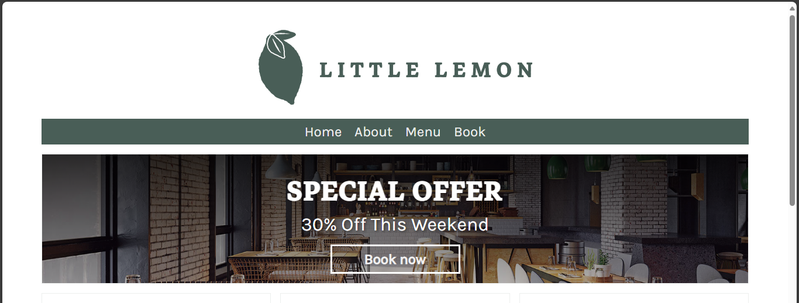
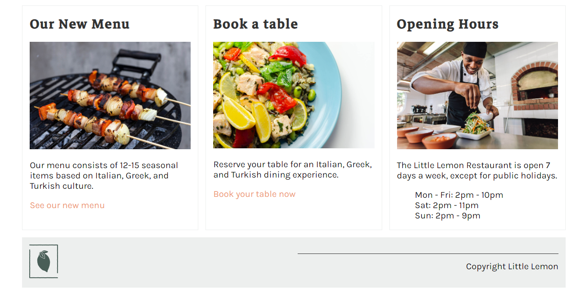
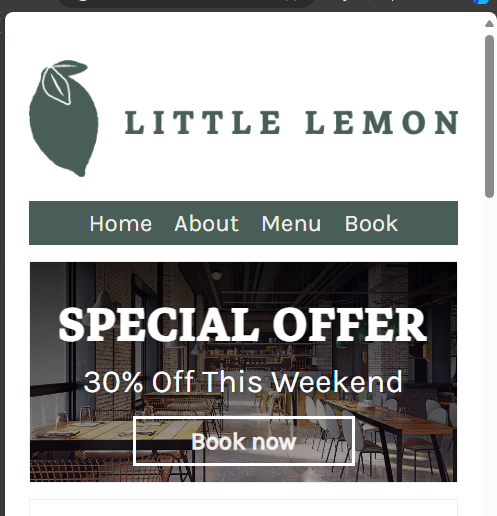
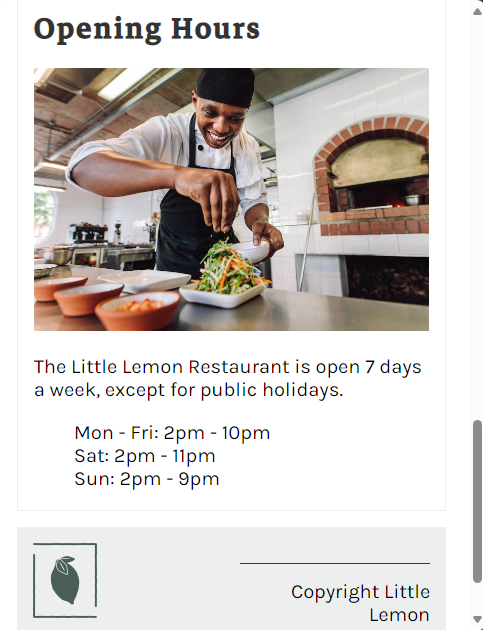
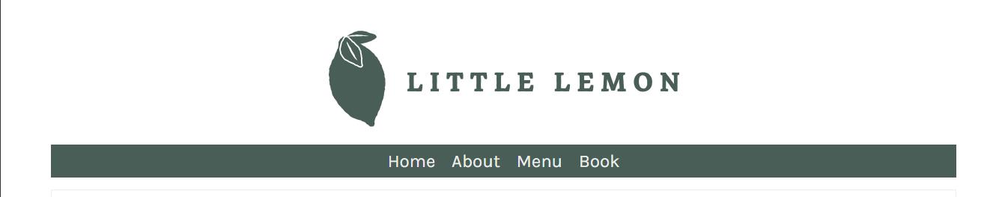
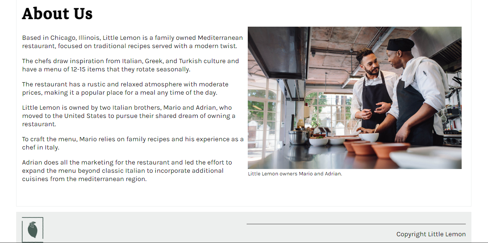
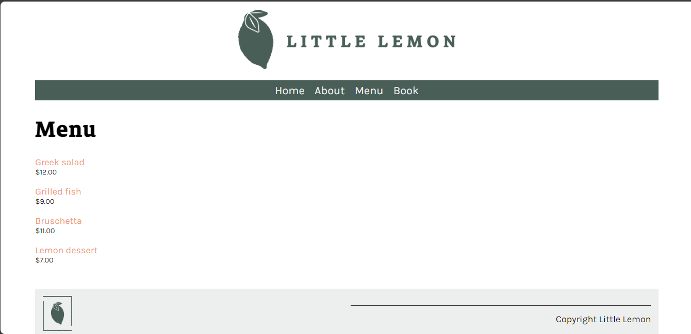
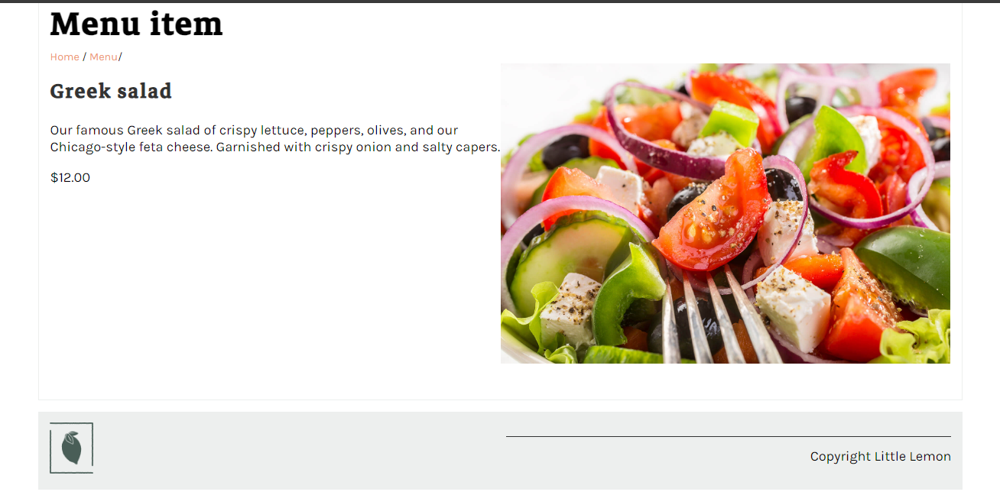
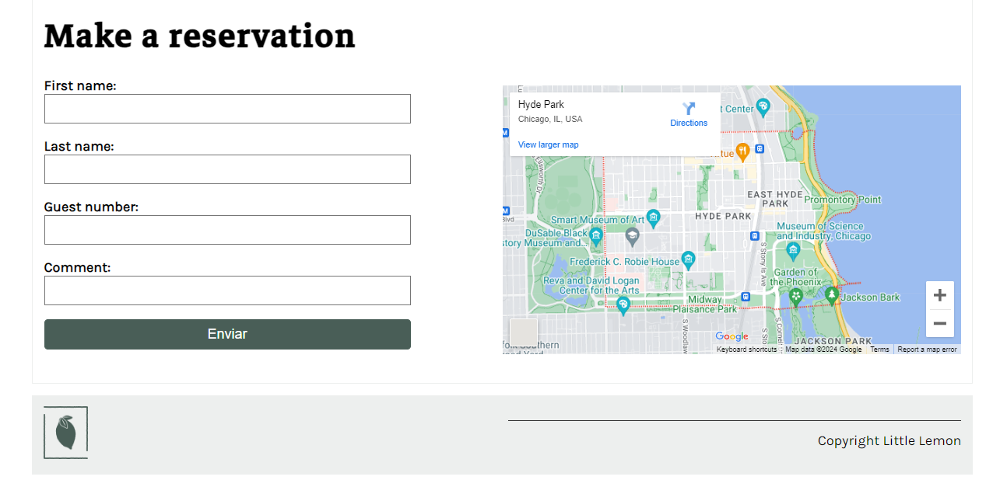

# Django Little Lemon Restaurant Website

This project serves as the culmination of my Django course, part of the Meta Backend Developer Professional Certificate. Through the course, I've acquired the essential skills and knowledge required to develop a website using Django framework by creating a project and an app.

## Project Overview

The goal of this project was to develop a website for the Little Lemon restaurant, showcasing its menu pages. Users can navigate through the site's main menu to access pages such as About, Menu, and Book.

## Features

### Homepage
- Displays information about the Little Lemon restaurant.
- Provides navigation links to other pages: About, Menu, and Book.

### About Page
- Presents details about the Little Lemon restaurant, such as its history, vision, and mission.

### Menu Page
- Lists menu items retrieved from the database.
- Each menu item includes:
  - Name
  - Price
  - Description
  - Image
- Users can click on individual menu items to view dedicated pages for each item.

### Book Page
- Allows users to make reservations at the Little Lemon restaurant.

## Technologies Used

### Django Framework
- **Model-View-Template (MVT) Architecture:** Django's MVT architecture facilitates the separation of concerns, enhancing the project's maintainability and scalability.
- **Object-Relational Mapping (ORM):** Django's ORM simplifies database interaction by abstracting SQL queries into Python code.
- **Admin Interface:** Utilized Django's built-in admin interface for managing menu items.

### HTML/CSS/JavaScript
- **Frontend Development:** Implemented frontend components using HTML for structure, CSS for styling, and JavaScript for interactivity.

### SQLITE
- **Database Management:** Utilized SQLITE as the database management system to store menu items and other relevant data.

## Project Structure

The project follows a typical Django project structure, consisting of:
- **littlelemon:** Contains settings, URLs, and other project-level configurations.
- **App (restaurant):** Implements functionality related to menu items, including models, views, templates, and static files.

## Conclusion

This Django project demonstrates my proficiency in building web applications using Django framework. By effectively leveraging Django's features and adhering to best practices, I've developed a fully functional website for the Little Lemon restaurant, providing users with an intuitive interface to explore its menu offerings and make reservations.